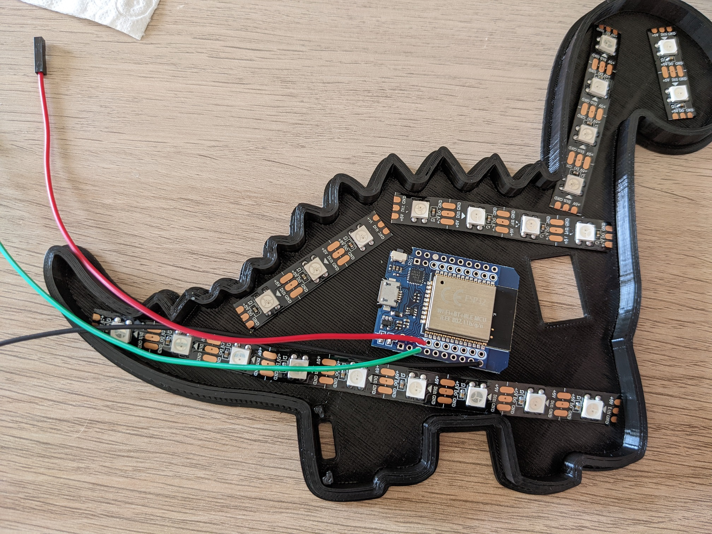
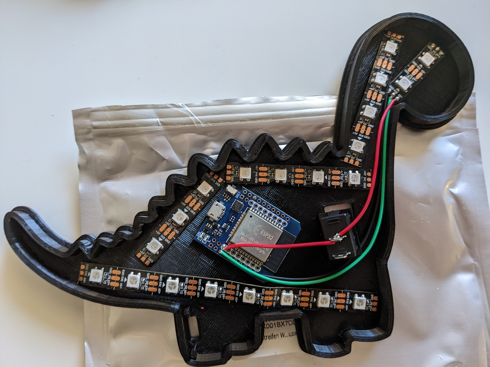
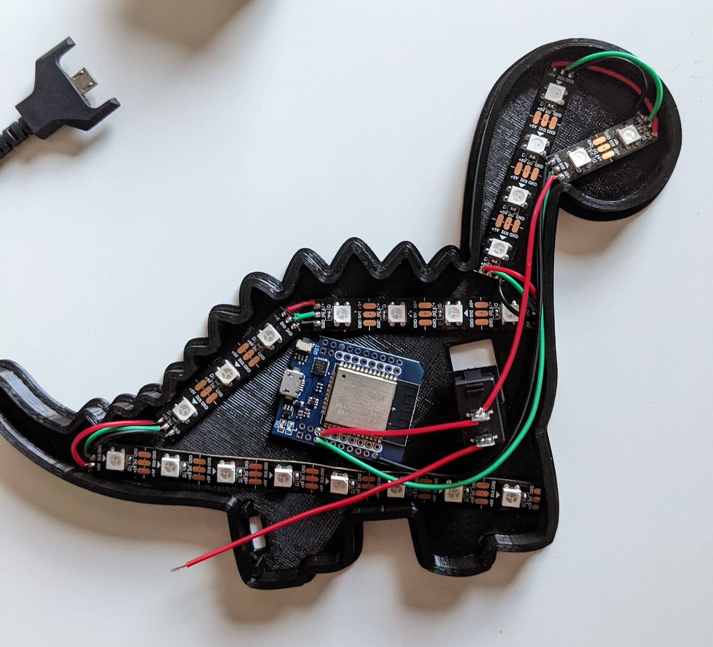
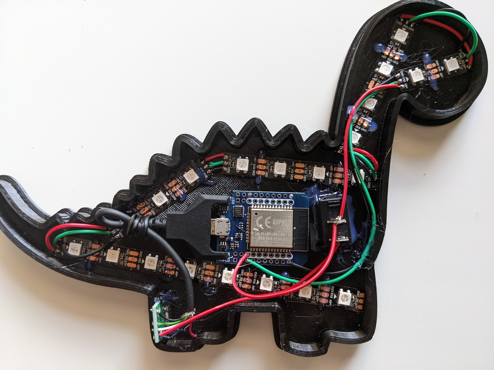
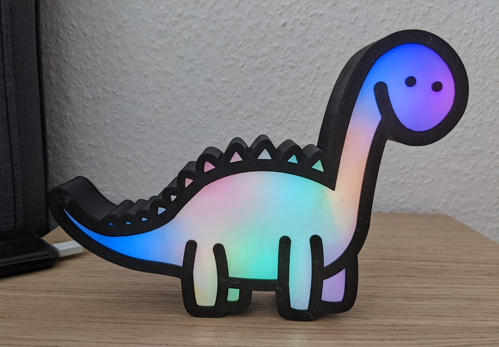

# Dino-Night-Light

A 3D printed LED dino night light with built-in ESP32

	

# 3D print

[Dino Night Light ](https://www.thingiverse.com/thing:5277348)

# List of parts

- 3D printed dino parts
- [ESP32](https://www.amazon.de/-/en/KeeYees-Bluetooth-Internet-Development-ESP-WROOM-32/dp/B08TBPBJGV/ref=sr_1_5?crid=2N1K1QNN04APW&keywords=esp32&qid=1656515631&sprefix=esp32%2Caps%2C121&sr=8-5)
- [WS2812 LED strip](https://www.amazon.de/-/en/Ws2812b-Individually-Addressable-Programmable-Flexible/dp/B078S6Z9KG/ref=sr_1_5?keywords=ws2812b&qid=1656515676&sr=8-5)
- Male micro usb cable
- [Power switch](https://www.amazon.de/gp/product/B07QB22J62/ref=ppx_yo_dt_b_asin_title_o05_s01?ie=UTF8&psc=1&tag=tv-nothing-20)
- [Micro usb port](https://www.amazon.de/gp/product/B07RDHNL9H/ref=ppx_yo_dt_b_asin_title_o00_s00?ie=UTF8&psc=1&tag=tv-nothing-20)
- Cables
- [Glue](https://www.amazon.de/-/en/Hot-Glue-Gun-20W-100W/dp/B06VWT71FG/ref=sr_1_3?keywords=klebepistole&qid=1656515819&sr=8-3)

# Software

[WLED](https://github.com/Aircoookie/WLED)

[Installation](https://install.wled.me/)

[Android App](https://play.google.com/store/apps/details?id=com.aircoookie.WLED)

# Assembly

1. LED layout

	

2. First few LEDs connected

	

3. All LEDs connected

	

4. Use an old male micro usb cable. Connect it to the switch.

	

5. Glue everything in place. (Connected the ESP directly to the switch since this was more convenient.)

	

# Result

	

